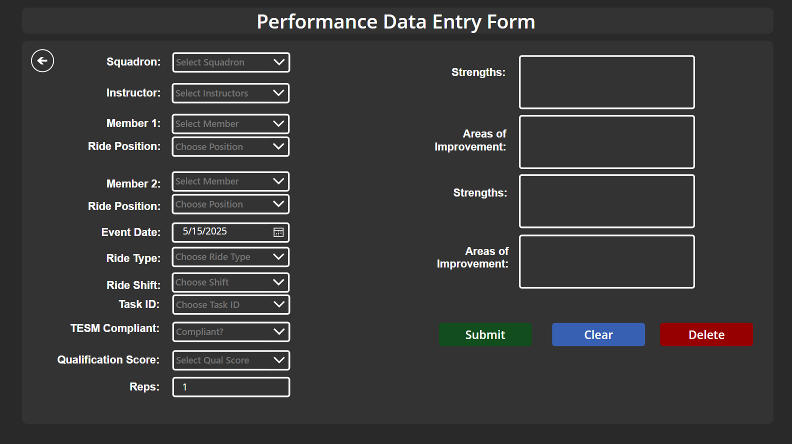
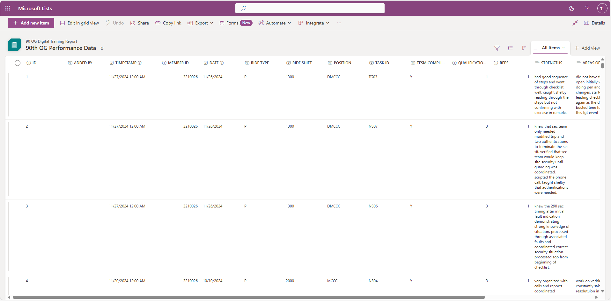
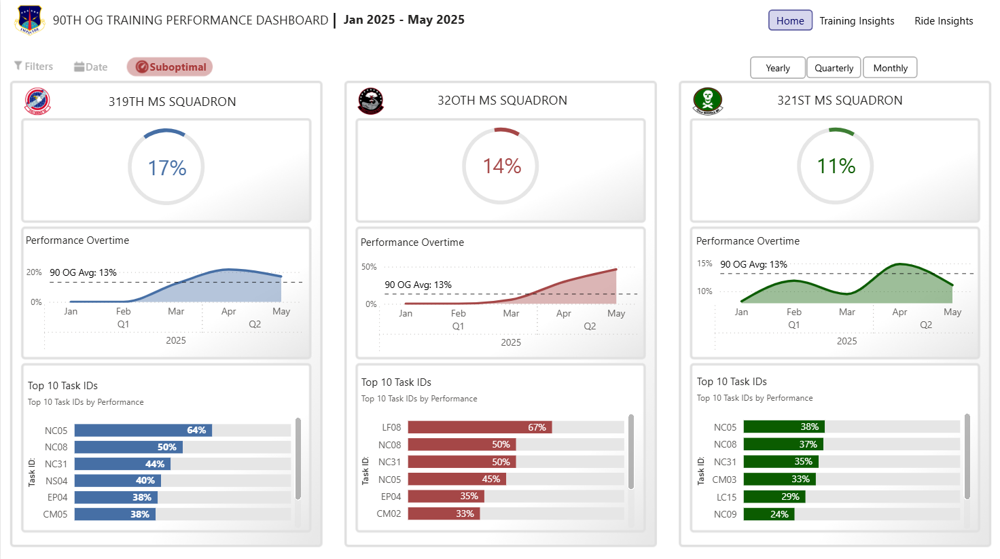

# Missileer Training Performance Dashboard

## Project Overview

To address the lack of structured performance tracking within a high-readiness operational unit, I developed a secure, scalable dashboard solution that monitors simulation-based training performance across ~200 military personnel.

The solution was initially designed for one squadron and later scaled to serve the entire group. By providing leadership with monthly insights into which simulations had the lowest success rates, the team could proactively design new training scenarios targeting key weaknesses.

> **Note:** Due to this being a project I developed for my work in the Air Force, no actual data is shared with limited screenshots. This write-up focuses on process, tools, and impact.

---

## Objectives

- Automate data collection and minimize manual errors
- Enable real-time insight into training performance
- Inform leadership decisions with actionable metrics
- Ensure security and compliance for sensitive personnel data

---

## Tools & Technologies Used

- **Power BI**: Row-level security, KPIs, trend analysis, incremental refresh
- **PowerApps**: Custom forms for user-friendly data entry and validation
- **Microsoft SharePoint Lists**: Secure data storage and access control

---

## Technical Implementation

### Data Collection & Storage
- Built a PowerApps-based form with dynamic validation to prevent manual entry errors
  
- Leveraged SharePoint List as a centralized, permission-controlled data source
  

### Data Modeling & Dashboarding
- Built a Power BI data model with over 10,000 training records
- Used row-level security to tailor views per user role
- Created measures for repeat event frequency and scenario-level success rates
  

### Deployment & Use
- Leadership accesses the dashboard monthly to identify underperforming scenarios
- Insights from the dashboard directly inform future training simulation development

---

## Results & Impact

- **10,000+ rows of data collected** securely
- **~200 active users across multiple squadrons**
- Improved identification of low-performing training areas
- Streamlined development of targeted monthly simulation scenarios
- Recognized with a **Group Commander’s coin** for innovation and impact

---

## Contributions & Collaboration

- Sole developer of entire data pipeline and dashboard
- Collaborated with the Flight Commander to align features with operational needs
- Trained users across ranks on how to navigate and use the dashboard

---

## Skills Gained

- Power BI dashboard development and RLS
- PowerApps integration with SharePoint Lists
- Stakeholder communication and feedback integration
- Secure, scalable data architecture in low-code environments
